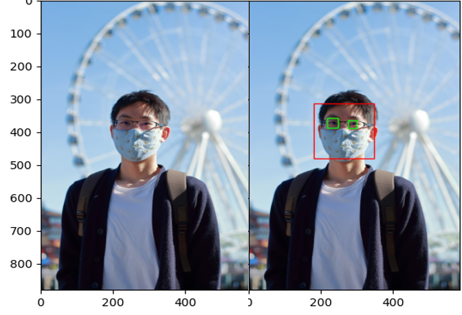
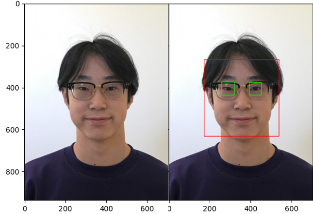
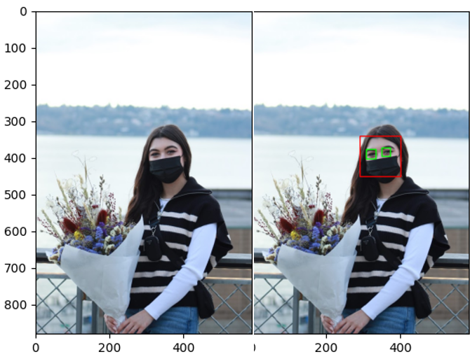
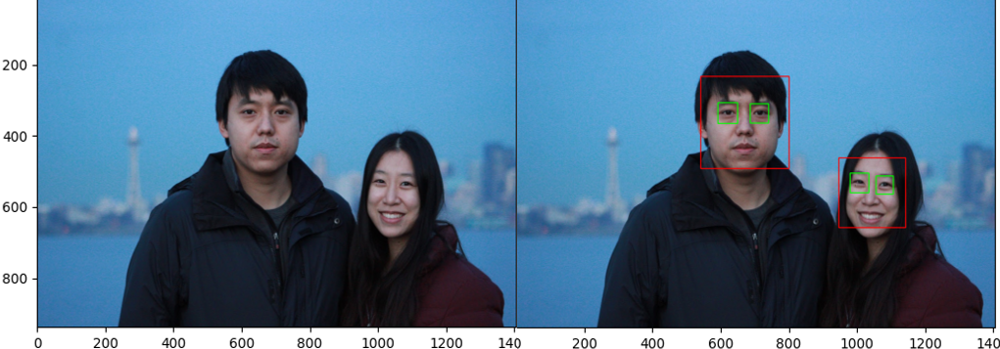

# FacialRecognitionandForegroundProcessing

Uses the OpenCV python library for facial recognition and extracting the foreground of an image.

Facial Recognition Code from: https://www.analyticsvidhya.com/blog/2019/03/opencv-functions-computer-vision-python/

Foreground Processing Code from: https://www.geeksforgeeks.org/python-foreground-extraction-in-an-image-using-grabcut-algorithm/

Facial Recognition:  

Foreground Processing:  

Note: Both programs only work on certain images I tried, possibly due to lighting, angle, or other features of the image.
